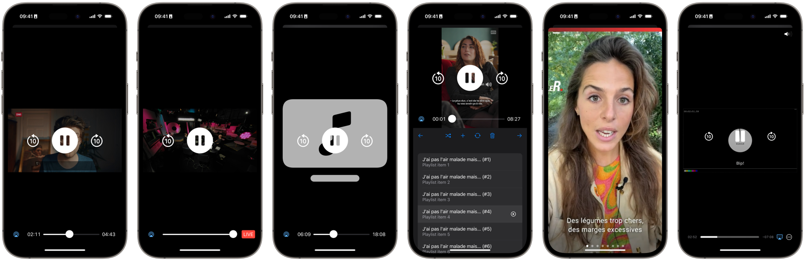

<!-- markdownlint-disable-next-line MD041 -->
[](https://github.com/SRGSSR/pillarbox-apple)

# Overview

[](https://swiftpackageindex.com/SRGSSR/pillarbox-apple) [](https://swiftpackageindex.com/SRGSSR/pillarbox-apple) [](https://swift.org/package-manager) [](LICENSE) [](https://testflight.apple.com/join/TS6ngLqf)

Pillarbox is the iOS and tvOS modern reactive SRG SSR player ecosystem implemented on top of AVFoundation and AVKit. Pillarbox has been designed with robustness, efficiency and flexibilty in mind, with full customization of:

- Metadata and asset URL retrieval.
- Asset resource loading, including support for FairPlay.
- Analytics and QoS integration.
- User interface layout in SwiftUI.

> [!IMPORTANT]
> Even though Pillarbox offers features that are specific to our company, its player is fully generic and can be used to play any kind of content.

# Features

Pillarbox player provides all essential playback features you might expect:

- Audio and video (standard / monoscopic 360°) playback.
- Support for on-demand and live streams (with or without DVR).
- First-class integration with SwiftUI to create the stunning playback user experience that your application deserves.
- Integration with the standard system playback user experience, both on iOS and tvOS.
- Playlist management including bidirectional navigation.
- Support for alternative audio tracks, Audio Description, subtitles, CC and SDH, all tightly integrated with standard system accessibility features.
- Metadata and chapter support.
- AirPlay compatibility.
- Control center integration.
- Multiple instance support.
- Best-in-class Picture in Picture support.
- The smoothest possible seek experience on Apple devices, with blazing-fast content navigation in streams enabled for trick play.
- Playback speed controls.

In addition Pillarbox provides the ability to play all SRG SSR content through a dedicated package.

# Showcase

Here are a few examples of layouts which can be achieved using Pillarbox and SwiftUI, directly borrowed from our demo project:

[](https://github.com/SRGSSR/pillarbox-apple)

From left to right:

- Screenshots 1, 2 and 3: [Rich custom player user interface](Demo/Sources/Players/PlaybackView.swift).
- Screenshot 4: [Player with associated playlist](Demo/Sources/Showcase/Playlist/PlaylistView.swift).
- Screenshot 5: [Stories](Demo/Sources/Showcase/Stories/StoriesView.swift).
- Screenshot 6: [Custom chapter navigation](Demo/Sources/Players/PlayerView.swift).

# Compatibility

The library is suitable for applications running on iOS 16, tvOS 16 and above.

# Integration

The library can be integrated using [Swift Package Manager](https://swift.org/package-manager) directly [within Xcode](https://developer.apple.com/documentation/xcode/adding_package_dependencies_to_your_app). You can also declare the library as a dependency of another one directly in the associated `Package.swift` manifest.

If you want your application to run on Silicon Macs as an iPad application you must add `-weak_framework MediaPlayer` to your target _Other Linker Flags_ setting.

# Documentation

Pillarbox documentation includes articles, tutorials and an API reference to help you learn more about available features and how to integrate them into your application.

> [!TIP]
> If you discover errors in the documentation or if some documentation is missing please file a dedicated [issue](https://github.com/SRGSSR/pillarbox-apple/issues/new/choose). You can also directly submit documentation improvements via [pull requests](https://github.com/SRGSSR/pillarbox-apple/compare).

## DocC documentation

Documentation is available as a [DocC](https://developer.apple.com/documentation/docc) documentation catalog. This catalog must be built by opening the project with Xcode and selecting _Product_ > _Build Documentation_. You can then access it right from within the Xcode documentation window.

## Online documentation

Documentation for each major product provided by Pillarbox can also be found online on [Swift Package Index](https://swiftpackageindex.com/SRGSSR/pillarbox-apple):

- [Player](https://swiftpackageindex.com/SRGSSR/pillarbox-apple/documentation/pillarboxplayer): Create engaging audio and video playback experiences.
- [CoreBusiness](https://swiftpackageindex.com/SRGSSR/pillarbox-apple/documentation/pillarboxcorebusiness): Play SRG SSR content with the Player framework.
- [Monitoring](https://swiftpackageindex.com/SRGSSR/pillarbox-apple/documentation/pillarboxmonitoring): Monitor playback activity.
- [Analytics](https://swiftpackageindex.com/SRGSSR/pillarbox-apple/documentation/pillarboxanalytics): Measure app usage according to SRG SSR requirements.

Documentation is also available for companion products:

- [Core](https://swiftpackageindex.com/SRGSSR/pillarbox-apple/documentation/pillarboxcore): Essential tools used when implementing Pillarbox.
- [Circumspect](https://swiftpackageindex.com/SRGSSR/pillarbox-apple/documentation/pillarboxcircumspect): A [Nimble](https://github.com/Quick/Nimble)-based framework for testing Combine publishers.

> [!TIP]
> Documentation available from the above links opens for the latest tag. Use Swift Package Index navigation top bar to quickly switch to another tag or `main`.

## Miscellaneous documentation

Further documentation is also available by following the links below:

- [Known issues](docs/KNOWN_ISSUES.md)
- [Development setup](docs/DEVELOPMENT_SETUP.md)
- [Continuous integration](docs/CONTINUOUS_INTEGRATION.md)

# Plugins

The package provides a single plugin which automatically inserts correct versioning information into binaries. This plugin must be trusted interactively when a project integrating Pillarbox is built using Xcode for the first time.

On a continuous integration server you must trust plugins automatically by setting an appropriate default:

```shell
defaults write com.apple.dt.Xcode IDESkipPackagePluginFingerprintValidatation -bool YES
```

If you are using Xcode Cloud this can be achieved with a [custom build script](https://developer.apple.com/documentation/xcode/writing-custom-build-scripts).

If your project is built with `xcodebuild` directly the same effect can be achieved by passing the `-skipPackagePluginValidation` option.

# Code example

With Pillarbox creating a custom video player user interface has never been easier. Simply instantiate a `Player` and start building your user interface in SwiftUI right away:

```swift
import PillarboxPlayer
import SwiftUI

struct PlayerView: View {
    @StateObject private var player = Player(
        item: .simple(url: URL(string: "https://devstreaming-cdn.apple.com/videos/streaming/examples/img_bipbop_adv_example_ts/master.m3u8")!)
    )

    var body: some View {
        ZStack {
            VideoView(player: player)
            Button(action: player.togglePlayPause) {
                Image(systemName: player.shouldPlay ? "pause.circle.fill" : "play.circle.fill")
                    .resizable()
                    .frame(width: 80, height: 80)
            }
        }
        .onAppear(perform: player.play)
    }
}
```

With the expressiveness of SwiftUI, our rich playback API and the set of components at your disposal you will have a full-fledged player user interface in no time.

# Contributing

If you want to contribute to the project have a look at our [contributing guide](docs/CONTRIBUTING.md).

# License

See the [LICENSE](LICENSE) file for more information.
