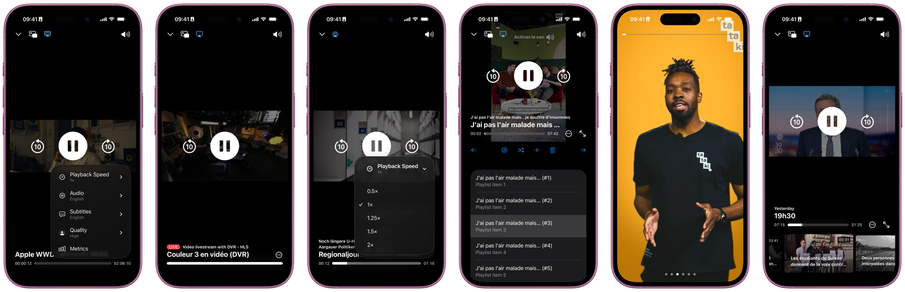

# Overview

Pillarbox is the modern SRG SSR player ecosystem implemented on top of AVFoundation and AVKit. Pillarbox was designed with flexibilty in mind, letting you fully customize:

- Metadata and asset URL retrieval.
- Asset resource loading.
- Analytics and QoS integration.
- User interface layout in SwiftUI.

Its robust reactive player provides all essential playback features, as well as:

- Support for playlists, including bidirectional navigation.
- First-class integration with SwiftUI.
- AirPlay compatibility.
- Control center integration.

In addition Pillarbox provides the ability to play all SRG SSR content through a dedicated package.

# Showcase

Here are a few examples of layouts which can be achieved using Pillarbox and SwiftUI, directly borrowed from our demo project:

From left to right:

- Screenshots 1, 2 and 3: [Standard player interface](../Demo/Sources/PlaybackView.swift) showing on-demand video, video livestream and audio stream playback respectively.
- Screenshot 4: [Player with associated playlist](../Demo/Sources/PlaylistView.swift).
- Screenshot 5: [Stories](../Demo/Sources/StoriesView.swift).
- Screenshot 6: [System AVKit user interface](../Demo/Sources/SystemPlayerView.swift).

# Compatibility

   

The library is suitable for applications running on iOS 16, tvOS 16 and above. The project is meant to be compiled with the latest Xcode version.

# Contributing

If you want to contribute to the project have a look at our [contributing guide](CONTRIBUTING.md).

# Integration

The library can be integrated using [Swift Package Manager](https://swift.org/package-manager) directly [within Xcode](https://developer.apple.com/documentation/xcode/adding_package_dependencies_to_your_app). You can also declare the library as a dependency of another one directly in the associated `Package.swift` manifest.

A few remarks:

- When building a project integrating Pillarbox for the first time, Xcode might ask you to trust our plugins. You should accept.
- If you want your application to run on Silicon Macs as an iPad application you must add `-weak_framework MediaPlayer` to your target _Other Linker Flags_ setting.

# Getting started

To learn more how integration of Pillarbox into your project please have a look at our [getting started guide](GETTING_STARTED.md).

# Documentation

Follow the links below for further documentation:

- [Known issues](KNOWN_ISSUES.md)
- [Development setup](DEVELOPMENT_SETUP.md)
- [Continuous integration](CONTINUOUS_INTEGRATION.md)
- [Test streams](TEST_STREAMS.md)

# License

See the [LICENSE](../LICENSE) file for more information.
